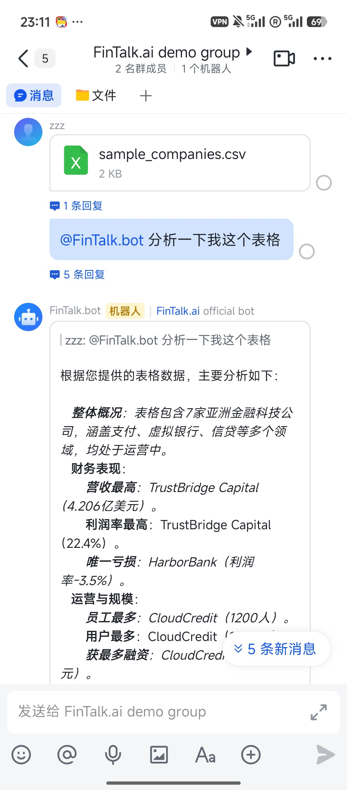
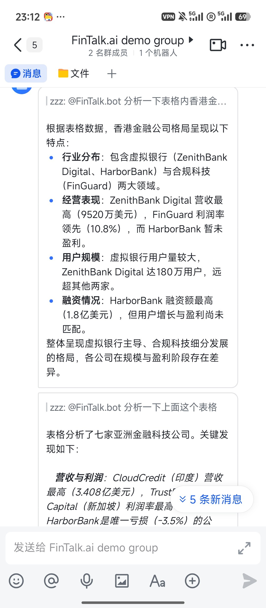
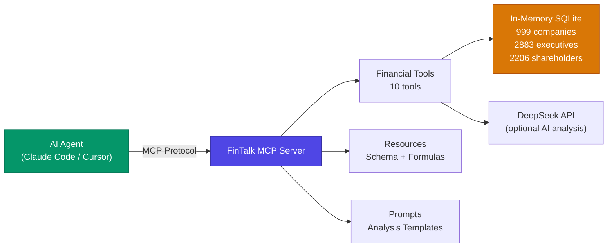

# FinTalk.ai

**Turn Natural Language into Financial Intelligence — 999 Companies, One Command**

<p align="center">
  <a href="https://boris-dotv.github.io/fintalk.v/"></a>
  <a href="LICENSE"></a>
  <a href="#"></a>
  <a href="#"></a>
  <a href="#"></a>
</p>

---

## Overview

FinTalk.ai is an **agent-ready financial data analysis system**. It lets any AI agent — Claude Code, Cursor, or custom MCP clients — analyze **999 fintech companies**, **2,883 executives**, and **2,206 shareholders** through natural language.

Ask a question, get a verified answer. No manual SQL, no data wrangling, no configuration.

```
> "Compare shareholder concentration between ZA Bank and WeLab Bank"
> "Which virtual banks have more than 500 employees?"
> "Analyze the governance structure of Ant Bank"
```

Behind the scenes, FinTalk trains its own NL2SQL models (SFT + GRPO reinforcement learning), orchestrates a dual-agent system for query understanding, and serves everything through a **single-file zero-config MCP Server**. Every data point is traceable to a verifiable source.

> **Adopted by [Digital Financial Services Research Center Limited](https://www.polyu.edu.hk/kteo/entrepreneurship/start-ups/polyu-start-ups-list/mf/2023/digital-financial-services-research-center-limited/)** (PolyU Micro Fund 2023) — a neobank research center building authoritative financial databases for academic and industrial research.
>
> **Official Website:** [https://boris-dotv.github.io/fintalk.v/](https://boris-dotv.github.io/fintalk.v/)

<p align="center">
  
</p>

---

## Why FinTalk?

Most financial data tools make you choose: either a static dataset, or a generic LLM wrapper that hallucinates numbers. FinTalk gives you both **accuracy and accessibility**.

| | Traditional BI Tools | Generic LLM + RAG | **FinTalk.ai** |
|---|---|---|---|
| Natural language queries | No | Yes, but unreliable SQL | **Yes, with execution-verified NL2SQL** |
| Structured financial ratios | Manual setup | No | **7 built-in ratios, extensible** |
| Multi-company comparison | Manual | Hallucination-prone | **Fuzzy matching + real data** |
| Agent integration | API wrappers needed | Custom glue code | **MCP native — zero integration code** |
| Data accuracy guarantee | High | Low | **High — GRPO-trained models, only correct SQL execution gets rewarded** |
| Setup complexity | Heavy | Medium | **One command: `uv run --script mcp_server.py`** |

---

## Demo

**Web App — Multi-Agent Trace Visualization:**


**Feishu Bot — Natural language financial analysis in chat:**

<p align="center">
  
  
</p>

**MCP Server connected in Claude Code:**

<p align="center">
  
</p>

**Querying financial data and comparing companies through natural language:**

<p align="center">
  
</p>

---

## Architecture: Three Layers

```
Layer 1: Intelligence        Layer 2: Framework           Layer 3: Interface
┌──────────────────┐    ┌──────────────────────┐    ┌──────────────────────┐
│  SFT + GRPO      │    │  Orchestrator Agent  │    │    MCP Server        │
│  LoRA Adapters   │───▶│  Worker Agent        │───▶│  10 Tools            │
│  NL2SQL / Classif│    │  MCP Core Modules    │    │  2 Resources         │
│                  │    │  OSWorld Sandbox     │    │  1 Prompt Template   │
└──────────────────┘    └──────────────────────┘    └──────────────────────┘
  Why analysis is         Why analysis is            How agents access
  accurate                fast & robust              the analysis
```

---

### Layer 1: Intelligence — Why Analysis is Accurate

The core challenge of financial data analysis is accuracy: wrong SQL → wrong numbers → wrong decisions. FinTalk solves this by training specialized models whose correctness is **verified by execution**.

| Stage | Method | Why It Matters for Analysis |
|-------|--------|-----------------------------|
| **Supervised Fine-Tuning** | SFT with LoRA on Qwen2.5-7B | Three specialized adapters (NL2SQL, Classification, Keyword Extraction) — each optimized for one analytical subtask instead of one generic model doing everything |
| **Reinforcement Learning** | GRPO via verl | **Only SQL that executes on the real database and returns the correct result gets rewarded** — the model learns what actually works, not what looks plausible |
| **Training Data Quality** | Synthetic pipeline (15,000+ samples) | SQL syntax validation → LLM-as-Judge scoring → Embedding-based semantic deduplication. No garbage in, no garbage out |
| **Privacy** | Schema-only generation | Training data generated from database schema alone — no real user data exposure |

---

### Layer 2: Framework — Why Analysis is Fast and Robust

A single financial question often requires multiple steps: rewrite the query, classify intent, check relevance, generate SQL, and produce a natural language answer. FinTalk runs these **in parallel** through an asymmetric dual-agent system.

**Orchestrator Agent** (`Qwen3-8B` via SGLang)
- Understands user intent, plans the analysis, synthesizes the final answer

**Worker Agent** (`Qwen2.5-7B-Instruct-1M` with dynamic LoRA)
- **Switches LoRA adapters on-the-fly** via SGLang+Punica — the same model handles NL2SQL, Classification, and Keyword Extraction without loading three separate models
- Result: lower latency, lower memory, higher throughput

**Parallel NLU Pipeline** — 4 modules run simultaneously on every user turn:

| Module | Function |
|--------|----------|
| `query_rewriter` | "And WeLab?" → "What is WeLab Bank's employee size?" (context-aware completion) |
| `arbitrator` | Route to: data analysis / knowledge Q&A / small talk / reject |
| `rejection_detector` | Filter out-of-scope queries before they waste compute |
| `correlation_checker` | Track multi-turn context ("compare it with the previous company") |

**Additional modules:** `parallel_executor`, `function_registry`, `streaming_nlg`, `conversation_manager`

**Sandboxed Execution** — All analysis runs inside Docker containers (OSWorld) with 512MB memory limit and read-only data mounts. No query can affect the source data.

---

### Layer 3: Interface — How Agents Access the Analysis

**One file. Zero config. Any AI agent.**

FinTalk exposes its entire financial analysis capability as an [MCP (Model Context Protocol)](https://modelcontextprotocol.io) server — a single self-contained Python file with inline dependency declarations. No database server, no Docker, no API keys required (DeepSeek key is optional).

```bash
# This is the entire setup:
uv run --script mcp_server.py
```

Data loads into **in-memory SQLite** at startup. The server is live in seconds.



#### MCP Tools (10)

| Tool | Parameters | Description |
|------|-----------|-------------|
| `list_tables` | — | List all database tables with row counts |
| `describe_table` | `table_name` | Get columns, types, and sample rows |
| `query_data` | `sql` | Execute read-only SQL SELECT queries |
| `load_csv` | `file_path`, `table_name?` | Load external CSV into database |
| `list_companies` | — | List all companies with basic info |
| `get_company_info` | `company_name` | Full company profile (fuzzy matching) |
| `get_top_shareholders` | `company_name`, `top_n?` | Top N shareholders with ownership % |
| `calculate_ratio` | `company_name`, `ratio_name` | Financial ratios (director ratios, concentration, etc.) |
| `compare_companies` | `company1`, `company2`, `metric` | Side-by-side company comparison |
| `ai_analyze` | `question`, `context?` | DeepSeek-powered natural language analysis |

#### MCP Resources

| URI | Description |
|-----|-------------|
| `fintalk://schema` | Complete database schema overview |
| `fintalk://formulas` | All available financial formulas |

#### MCP Prompt

| Name | Description |
|------|-------------|
| `analyze_company` | Multi-step company analysis workflow template |

---

## Quick Start

### Option 1: MCP Server (Recommended)

Connect FinTalk to Claude Code (or any MCP client) in seconds:

**One-line setup** (from terminal):

```bash
claude mcp add fintalk -e DEEPSEEK_API_KEY=your-key-here -- uv run --script /path/to/fintalk.v/mcp_server.py
```

Or **manually add** to Claude Code settings (`~/.claude/settings.json`):

```json
{
  "mcpServers": {
    "fintalk": {
      "command": "uv",
      "args": ["run", "--script", "/path/to/fintalk.v/mcp_server.py"],
      "env": {
        "DEEPSEEK_API_KEY": "your-key-here"
      }
    }
  }
}
```

**Restart Claude Code** — FinTalk tools appear automatically.

**3. Start asking:**

```
> Analyze ZA Bank's governance structure
> Compare shareholder concentration between ZA Bank and WeLab Bank
> Run SQL: SELECT name, employee_size FROM companies WHERE status = 'Live'
```

> `DEEPSEEK_API_KEY` is optional. Without it, 9 tools are available. With it, `ai_analyze` is also enabled.

### Option 2: Python Demo

```bash
git clone https://github.com/boris-dotv/fintalk.ai.git
cd fintalk.ai
pip install -r requirements.txt
python run.py
```

---

## Database

**999 companies** across fintech, virtual banking, and digital finance — with management teams and ownership structures.

### `companies` (999 rows, 39 columns)

| Field | Type | Description |
|-------|------|-------------|
| `company_sort_id` | INTEGER | Primary Key |
| `name` | TEXT | Company name |
| `website` | TEXT | Official URL |
| `employee_size` | TEXT | Employee count |
| `status` | TEXT | Operational status |
| `founder_name` | TEXT | Founder |
| `ceoname` | TEXT | CEO |
| `techSummary` | TEXT | Technology description |
| ... | ... | *(39 columns total)* |

### `management` (2,883 rows)

| Field | Type | Description |
|-------|------|-------------|
| `company_sort_id` | INTEGER | Foreign Key |
| `management_name` | TEXT | Executive name |
| `management_title` | TEXT | Job title |
| `director_type` | TEXT | Executive / Non-Executive / Independent |

### `shareholders` (2,206 rows)

| Field | Type | Description |
|-------|------|-------------|
| `company_sort_id` | INTEGER | Foreign Key |
| `shareholder_name` | TEXT | Investor name |
| `share_percentage` | TEXT | Ownership percentage |
| `shareholder_tag` | TEXT | Finance / Insurance / Retail / Technology |

---

## Project Structure

```
fintalk.ai/
├── mcp_server.py              # MCP Server (single file, zero-config)
├── run.py                      # Python demo entry point
├── enhanced_fintalk.py         # Main application
├── formula.py                  # Financial formula library
│
├── enhanced_core/              # MCP core modules (8 modules)
│   ├── parallel_executor.py
│   ├── query_rewriter.py
│   ├── arbitrator.py
│   ├── rejection_detector.py
│   ├── correlation_checker.py
│   ├── function_registry.py
│   ├── streaming_nlg.py
│   └── conversation_manager.py
│
├── mcp_integration/            # External API integrations
│   ├── mcp_client.py           # GitHub, Alpha Vantage, NewsAPI
│   └── logs/                   # Audit trail
│
├── data/                       # Financial datasets (CSV)
├── demos/                      # Demo scripts
├── tests/                      # Test suite
├── OSWorld/                    # Sandboxed execution environment
│
├── requirements.txt            # Full dependencies
├── requirements-mcp.txt        # MCP server only (3 packages)
└── assets/                     # Architecture diagrams
```

---

## Available Financial Ratios

| Ratio | Formula |
|-------|---------|
| `executive_director_ratio` | Executive Directors / Total Directors |
| `non_executive_director_ratio` | Non-Executive Directors / Total Directors |
| `independent_director_ratio` | Independent Directors / Total Directors |
| `management_to_employee_ratio` | Total Managers / Employee Size |
| `shareholder_concentration` | Sum of Top N Share Percentages |
| `institutional_ownership_percentage` | Total Institutional Shares / 100 |
| `largest_shareholder_stake` | Max Share Percentage / 100 |

---

## Contributing

Contributions are welcome. Please submit a Pull Request.

## License

Apache 2.0 — see [LICENSE](LICENSE).

## Acknowledgments

- **Qwen Team** — language models and embeddings
- **OSWorld** — standardized agent execution environment
- **SGLang & Punica** — efficient model serving with dynamic LoRA
- **verl** — reinforcement learning framework
- **Model Context Protocol** — the agent interoperability standard
- **DeepSeek** — API for natural language analysis
