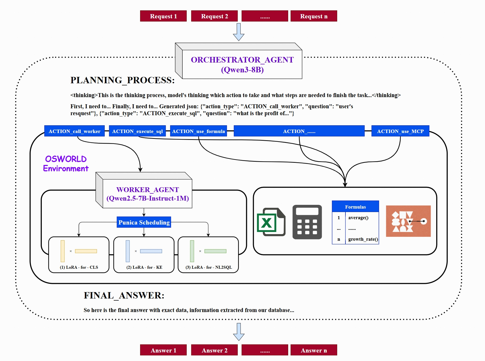
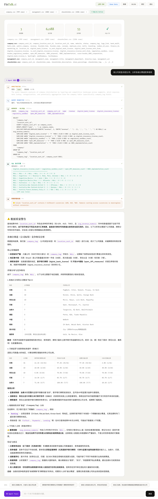
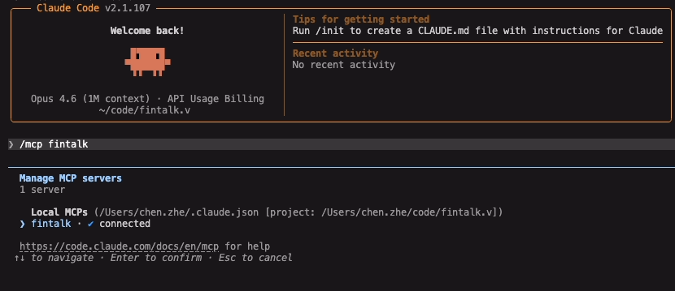
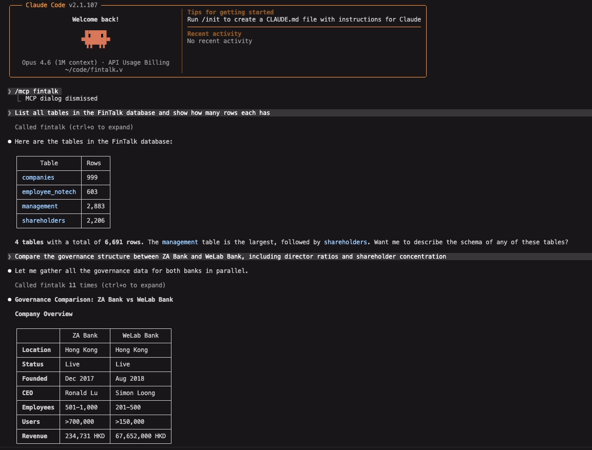
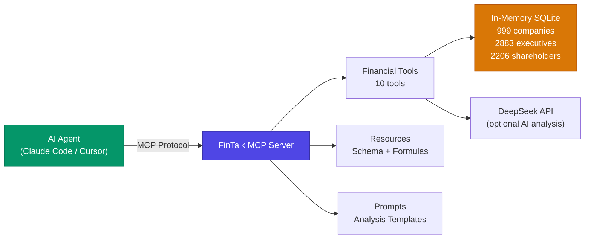

# FinTalk.ai

**From Model Training to Agent-Ready Financial Intelligence**

<p align="center">
  <a href="LICENSE"></a>
  <a href="#"></a>
  <a href="#"></a>
  <a href="#"></a>
</p>

---

## Overview

FinTalk.ai is a three-layer financial intelligence system that goes from **training specialized models**, through a **multi-agent orchestration framework**, to an **MCP Server** that any AI agent can call. It bridges the gap between LLM capabilities and the rigorous demands of financial analysis — every data point is traceable to a verifiable source.

<p align="center">
  
</p>

---

## Demo

**Web App — Multi-Agent Trace Visualization:**



**MCP Server connected in Claude Code:**

<p align="center">
  
</p>

**Querying financial data and comparing companies through natural language:**

<p align="center">
  
</p>

---

## Architecture: Three Layers

```
Layer 1: Intelligence        Layer 2: Framework           Layer 3: Interface
┌──────────────────┐    ┌──────────────────────┐    ┌──────────────────────┐
│  SFT + GRPO      │    │  Orchestrator Agent  │    │    MCP Server        │
│  LoRA Adapters   │───▶│  Worker Agent        │───▶│  10 Tools            │
│  NL2SQL / Classif│    │  MCP Core Modules    │    │  2 Resources         │
│                  │    │  OSWorld Sandbox     │    │  1 Prompt Template   │
└──────────────────┘    └──────────────────────┘    └──────────────────────┘
   Train the brain       Orchestrate the work        Expose to any AI agent
```

---

### Layer 1: Intelligence — Financial Model Training

Fine-tuned models that understand financial queries, generate SQL, and classify intent.

| Stage | Method | Details |
|-------|--------|---------|
| **Supervised Fine-Tuning** | SFT with LoRA | NL2SQL, Classification, Keyword Extraction adapters on Qwen2.5-7B-Instruct-1M |
| **Reinforcement Learning** | GRPO via verl | Rule-based rewards — only correct SQL execution with correct results gets rewarded |
| **Embedding** | Qwen3-Embedding-8B | Vector-based semantic deduplication for training data |
| **Privacy** | Synthetic data pipeline | No real user data in training |

---

### Layer 2: Framework — Multi-Agent Orchestration

An asymmetric dual-agent system running inside the OSWorld sandbox for reproducible execution.

**Orchestrator Agent** (`Qwen3-8B` via vLLM)
- High-level reasoning, planning, and answer synthesis
- Routes queries to the right Worker skill

**Worker Agent** (`Qwen2.5-7B-Instruct-1M` with dynamic LoRA)
- **NL2SQL** — generates precise SQL from natural language
- **Classification** — intent routing (task / knowledge / small talk)
- **Keyword Extraction** — entity and semantic parsing

**MCP Core Modules:**

| Module | Function |
|--------|----------|
| `parallel_executor` | Execute multiple LLM tasks simultaneously |
| `query_rewriter` | Context-aware query rewriting from conversation history |
| `arbitrator` | Classify query type: task / knowledge / small_talk / invalid |
| `rejection_detector` | Filter irrelevant queries |
| `correlation_checker` | Multi-turn context tracking |
| `function_registry` | Financial function calling registry |
| `streaming_nlg` | Real-time natural language generation |
| `conversation_manager` | Dialog history and slot management |

---

### Layer 3: Interface — MCP Server

**The key innovation.** FinTalk exposes its entire financial analysis capability as an [MCP (Model Context Protocol)](https://modelcontextprotocol.io) server. Any AI agent — Claude Code, Cursor, or custom MCP clients — can directly call FinTalk's tools.



#### MCP Tools (10)

| Tool | Parameters | Description |
|------|-----------|-------------|
| `list_tables` | — | List all database tables with row counts |
| `describe_table` | `table_name` | Get columns, types, and sample rows |
| `query_data` | `sql` | Execute read-only SQL SELECT queries |
| `load_csv` | `file_path`, `table_name?` | Load external CSV into database |
| `list_companies` | — | List all companies with basic info |
| `get_company_info` | `company_name` | Full company profile (fuzzy matching) |
| `get_top_shareholders` | `company_name`, `top_n?` | Top N shareholders with ownership % |
| `calculate_ratio` | `company_name`, `ratio_name` | Financial ratios (director ratios, concentration, etc.) |
| `compare_companies` | `company1`, `company2`, `metric` | Side-by-side company comparison |
| `ai_analyze` | `question`, `context?` | DeepSeek-powered natural language analysis |

#### MCP Resources

| URI | Description |
|-----|-------------|
| `fintalk://schema` | Complete database schema overview |
| `fintalk://formulas` | All available financial formulas |

#### MCP Prompt

| Name | Description |
|------|-------------|
| `analyze_company` | Multi-step company analysis workflow template |

---

## Quick Start

### Option 1: MCP Server (Recommended)

Connect FinTalk to Claude Code (or any MCP client) in seconds:

**One-line setup** (from terminal):

```bash
claude mcp add fintalk -e DEEPSEEK_API_KEY=your-key-here -- uv run --script /path/to/fintalk.v/mcp_server.py
```

Or **manually add** to Claude Code settings (`~/.claude/settings.json`):

```json
{
  "mcpServers": {
    "fintalk": {
      "command": "uv",
      "args": ["run", "--script", "/path/to/fintalk.v/mcp_server.py"],
      "env": {
        "DEEPSEEK_API_KEY": "your-key-here"
      }
    }
  }
}
```

**Restart Claude Code** — FinTalk tools appear automatically.

**3. Start asking:**

```
> Analyze ZA Bank's governance structure
> Compare shareholder concentration between ZA Bank and WeLab Bank
> Run SQL: SELECT name, employee_size FROM companies WHERE status = 'Live'
```

> `DEEPSEEK_API_KEY` is optional. Without it, 9 tools are available. With it, `ai_analyze` is also enabled.

### Option 2: Python Demo

```bash
git clone https://github.com/boris-dotv/fintalk.ai.git
cd fintalk.ai
pip install -r requirements.txt
python run.py
```

---

## Database

**999 companies** across fintech, virtual banking, and digital finance — with management teams and ownership structures.

### `companies` (999 rows, 39 columns)

| Field | Type | Description |
|-------|------|-------------|
| `company_sort_id` | INTEGER | Primary Key |
| `name` | TEXT | Company name |
| `website` | TEXT | Official URL |
| `employee_size` | TEXT | Employee count |
| `status` | TEXT | Operational status |
| `founder_name` | TEXT | Founder |
| `ceoname` | TEXT | CEO |
| `techSummary` | TEXT | Technology description |
| ... | ... | *(39 columns total)* |

### `management` (2,883 rows)

| Field | Type | Description |
|-------|------|-------------|
| `company_sort_id` | INTEGER | Foreign Key |
| `management_name` | TEXT | Executive name |
| `management_title` | TEXT | Job title |
| `director_type` | TEXT | Executive / Non-Executive / Independent |

### `shareholders` (2,206 rows)

| Field | Type | Description |
|-------|------|-------------|
| `company_sort_id` | INTEGER | Foreign Key |
| `shareholder_name` | TEXT | Investor name |
| `share_percentage` | TEXT | Ownership percentage |
| `shareholder_tag` | TEXT | Finance / Insurance / Retail / Technology |

---

## Project Structure

```
fintalk.ai/
├── mcp_server.py              # MCP Server (single file, zero-config)
├── run.py                      # Python demo entry point
├── enhanced_fintalk.py         # Main application
├── formula.py                  # Financial formula library
│
├── enhanced_core/              # MCP core modules (8 modules)
│   ├── parallel_executor.py
│   ├── query_rewriter.py
│   ├── arbitrator.py
│   ├── rejection_detector.py
│   ├── correlation_checker.py
│   ├── function_registry.py
│   ├── streaming_nlg.py
│   └── conversation_manager.py
│
├── mcp_integration/            # External API integrations
│   ├── mcp_client.py           # GitHub, Alpha Vantage, NewsAPI
│   └── logs/                   # Audit trail
│
├── data/                       # Financial datasets (CSV)
├── demos/                      # Demo scripts
├── tests/                      # Test suite
├── OSWorld/                    # Sandboxed execution environment
│
├── requirements.txt            # Full dependencies
├── requirements-mcp.txt        # MCP server only (3 packages)
└── assets/                     # Architecture diagrams
```

---

## Available Financial Ratios

| Ratio | Formula |
|-------|---------|
| `executive_director_ratio` | Executive Directors / Total Directors |
| `non_executive_director_ratio` | Non-Executive Directors / Total Directors |
| `independent_director_ratio` | Independent Directors / Total Directors |
| `management_to_employee_ratio` | Total Managers / Employee Size |
| `shareholder_concentration` | Sum of Top N Share Percentages |
| `institutional_ownership_percentage` | Total Institutional Shares / 100 |
| `largest_shareholder_stake` | Max Share Percentage / 100 |

---

## Contributing

Contributions are welcome. Please submit a Pull Request.

## License

Apache 2.0 — see [LICENSE](LICENSE).

## Acknowledgments

- **Qwen Team** — language models and embeddings
- **OSWorld** — standardized agent execution environment
- **vLLM & Punica** — efficient model serving with dynamic LoRA
- **verl** — reinforcement learning framework
- **Model Context Protocol** — the agent interoperability standard
- **DeepSeek** — API for natural language analysis
