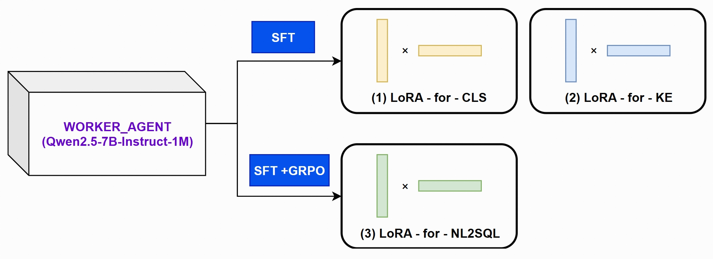

# FinTalk.v

**A Grounded Orchestration Framework for Multi-Agent Collaboration on Financial Tasks Leveraging the OSWorld Environment**

<p align="center">
  <a href="LICENSE"></a>
  <a href="#"></a>
  <a href="#"></a>
</p>

---

## Overview

FinTalk.ai is a cutting-edge multi-agent framework designed to bridge the gap between Large Language Model capabilities and the rigorous demands of financial analysis. Built upon the **OSWorld Environment** for secure, reproducible execution, it employs an **Orchestrator-Worker architecture** to interpret natural language queries, interact with structured databases, perform deterministic computations, and synthesize factually grounded intelligence.

<p align="center">
  
</p>

## What's New

### MCP Integration (Model Context Protocol)

FinTalk.ai now integrates **MCP architecture** for enhanced capabilities:

- **🧠 Parallel Model Execution** - Execute multiple LLM tasks simultaneously for reduced latency
- **✏️ Query Rewriting** - Context-aware query enhancement based on conversation history
- **⚖️ Arbitration Mechanism** - Intelligent query classification (task/knowledge/small_talk/invalid)
- **🛡️ Rejection Detection** - Filter irrelevant queries automatically
- **🔗 Correlation Analysis** - Multi-turn conversation context tracking
- **🔧 Function Calling** - OpenAI-style function registry for financial operations
- **📡 Streaming NLG** - Real-time natural language generation
- **💬 Conversation Management** - Dialog history and slot management

### GitHub API Integration

- **🔍 GitHub Search** - Search repositories via public API
- **📝 Repository Management** - Create/update files, manage branches and issues directly through MCP tools
- **📊 Complete Audit Logging** - All MCP communications logged in `mcp_integration/logs/`

---

## Core Features

### 1. Grounded Cognition

Every piece of information is traceable to a verifiable source—a specific database row or a deterministic calculation result. Systematic elimination of factual hallucination.

### 2. Resource-Efficient Architecture

Asymmetric multi-agent design:
- **Orchestrator Agent** (`Qwen3-8B`) - High-level reasoning and planning
- **Worker Agent** (`Qwen2.5-7B-Instruct-1M`) - Specialized skills via dynamic LoRA serving
- **Punica Scheduling** - On-demand specialist deployment

### 3. Verifiable & Reproducible

Built upon **OSWorld Environment** for secure, sandboxed, and standardized agent execution. Ensures transparent, robust, and reproducible experimental results.

---

## System Architecture

### Dual-Agent System in OSWorld

#### The Orchestrator Agent
- **Model:** `Qwen3-8B`
- **Role:** Central nervous system for high-level reasoning, strategic planning, and answer synthesis
- **Deployment:** Served via **vLLM** for optimized inference

#### The Worker Agent
- **Model:** `Qwen2.5-7B-Instruct-1M`
- **Role:** Specialized tools via LoRA adapters
- **Skills:**
  1. **Keyword Extraction** - Semantic parsing and entity recognition
  2. **Classification** - Intent classification for strategic routing
  3. **NL2SQL** - High-precision SQL query generation

### MCP Core Modules

```
enhanced_core/
├── parallel_executor.py     # Parallel task execution
├── query_rewriter.py        # Context-based query rewriting
├── arbitrator.py            # Query type classification
├── rejection_detector.py    # Query filtering
├── correlation_checker.py   # Multi-turn context tracking
├── function_registry.py     # Financial function definitions
├── conversation_manager.py  # Dialog history management
└── streaming_nlg.py         # Streaming output & NLG
```

### MCP External Tools

```
mcp_integration/
├── mcp_client.py            # Real API integrations (no mock data)
│   ├── GitHub Search        # Public API, no auth required
│   ├── GitHub Repo Manager  # Full CRUD operations
│   ├── Google Search        # (Requires API key)
│   ├── Alpha Vantage        # Stock prices (Requires API key)
│   └── NewsAPI              # Financial news (Requires API key)
└── logs/                    # Complete audit trail
```

---

## Database Schema

### 1. `companies` Table
Master table containing comprehensive company profiles.

| Field | Type | Description |
|-------|------|-------------|
| `company_sort_id` | INTEGER | **Primary Key**, unique identifier |
| `name` | TEXT | Official company name |
| `website` | TEXT | Official website URL |
| `employee_size` | INTEGER | Total employee count |
| `techSummary` | TEXT | Technology stack description |
| ... | ... | *(39 columns total)* |

**Records:** 607 companies

### 2. `management` Table
Executive and management team details.

| Field | Type | Description |
|-------|------|-------------|
| `company_sort_id` | INTEGER | **Foreign Key** to companies |
| `management_name` | TEXT | Executive name |
| `management_title` | TEXT | Job title |
| `director_type` | TEXT | Directorship classification |

**Records:** 2,970 executives

### 3. `shareholders` Table
Ownership structure and investor information.

| Field | Type | Description |
|-------|------|-------------|
| `company_sort_id` | INTEGER | **Foreign Key** to companies |
| `shareholder_name` | TEXT | Investor name |
| `share_percentage` | FLOAT | Ownership percentage |
| `shareholder_tag` | TEXT | Investor type classification |

**Records:** 2,208 shareholders

---

## Quick Start

### 1. Installation

```bash
# Clone the repository
git clone https://github.com/boris-dotv/fintalk.ai.git
cd fintalk.ai

# Create virtual environment
python -m venv venv
source venv/bin/activate  # On Windows: venv\Scripts\activate

# Install dependencies
pip install -r requirements.txt
pip install python-dotenv requests
```

### 2. Configuration

Copy `.env.example` to `.env` and configure your API keys:

```bash
cp .env.example .env
```

Edit `.env` with your credentials:

```bash
# Required for GitHub integration
GITHUB_TOKEN=your_github_token_here

# Optional (for extended features)
GOOGLE_API_KEY=your_google_api_key
GOOGLE_CSE_ID=your_google_cse_id
ALPHA_VANTAGE_KEY=your_alpha_vantage_key
NEWS_API_KEY=your_news_api_key

# LLM API
LLM_API_KEY=your_llm_api_key
LLM_API_URL=https://qianfan.baidubce.com/v2/chat/completions
```

### 3. Run the Demo

**Option 1: Interactive Demo (Recommended)**
```bash
python run.py
```

**Option 2: Direct MCP Demo**
```bash
python demos/demo_with_mcp.py
```

**Option 3: GitHub Integration Test**
```bash
python tests/test_github_mcp.py
```

---

## Training Pipeline



### Training Stages

1. **Supervised Fine-Tuning (SFT)**
   - NL2SQL LoRA trained on large-scale synthetic dataset
   - Privacy-preserving data generation pipeline
   - Vector-based semantic deduplication with Qwen3-Embedding-8B

2. **Reinforcement Learning Refinement**
   - **verl** framework with **Group Relative Policy Optimization (GRPO)**
   - Rule-based verifiable reward signals
   - Reward granted only for successful SQL execution with correct results

---

## Project Structure

```
fintalk.ai/
├── run.py                    # Unified entry point
├── enhanced_fintalk.py       # Main application
├── formula.py                # Financial formula library
│
├── enhanced_core/            # MCP core modules (8 modules)
├── mcp_integration/          # MCP external tools
├── demos/                    # Demo collection
├── tests/                    # Test suite
├── OSWorld/                  # OSWorld integration
├── data/                     # Database files
│
├── .env                      # API keys (not in repo)
├── .env.example             # Configuration template
├── requirements.txt          # Python dependencies
├── STRUCTURE.md             # Detailed project docs
└── API_REFERENCE.md         # API documentation
```

---

## Available Functions

### Local Database Functions

- `get_company_info` - Retrieve company profile information
- `get_executive_director_ratio` - Calculate executive director ratio
- `get_top_shareholders` - Get top N shareholders
- `calculate_shareholder_concentration` - Compute ownership concentration
- `compare_companies` - Compare two companies across metrics

### MCP External Tools

- `search_github` - Search GitHub repositories
- `github_repo_manager` - Full GitHub CRUD operations (get/create/update files, issues, branches)
- `web_search` - Google Custom Search (requires API key)
- `get_stock_price` - Real-time stock quotes (requires API key)
- `get_financial_news` - Financial news aggregation (requires API key)

---

## Example Usage

### Query Examples

**Local Database:**
```
User: "What is ZA Bank's employee size?"
User: "Calculate executive_director_ratio for WeLab Bank"
User: "Compare ZA Bank and WeLab Bank on shareholder concentration"
```

**GitHub Integration:**
```
User: "Search GitHub for model context protocol implementations"
User: "Get the content of enhanced_fintalk.py from my repo"
User: "Create a new file demo.py with hello world code"
```

---

## Contributing

Contributions are welcome! Please feel free to submit a Pull Request.

---

## License

This project is licensed under the Apache 2.0 License - see the [LICENSE](LICENSE) file for details.

---

## Acknowledgments

- **Qwen Team** for the excellent language models
- **OSWorld** for the standardized agent environment
- **vLLM & Punica** for efficient model serving
- **verl** for the RL framework
- **Model Context Protocol** community for the integration pattern
